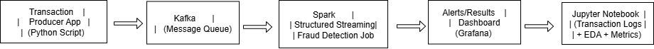

# real-time-fraud-detection
A real-time banking fraud detection pipeline using Kafka and Spark Streaming.

# 🏦 Real-Time Fraud Detection Pipeline

This project is a real-time fraud detection system for banking transactions using **Apache Kafka** and **Apache Spark Structured Streaming**. It simulates live transaction data, detects fraudulent patterns, and sends real-time alerts with a dashboard view.

---

## 📊 Architecture

---

## 🛠 Tech Stack

- Apache Kafka (Data Ingestion)
- Apache Spark Structured Streaming (Real-time Processing)
- Python
- Docker & Docker Compose
- Grafana (Visualization)
- Jupyter Notebook (EDA, metrics)

---

## 🔁 How It Works

1. A Python producer simulates bank transactions.
2. Kafka collects transaction data into topics.
3. Spark reads transactions from Kafka, applies fraud detection logic.
4. If fraud is detected (e.g., unusual amounts, geo anomalies), it triggers alerts.
5. Grafana dashboard displays real-time metrics and alerts.
6. Jupyter Notebook helps analyze transaction logs and trends.

---

## 📂 Project Structure

